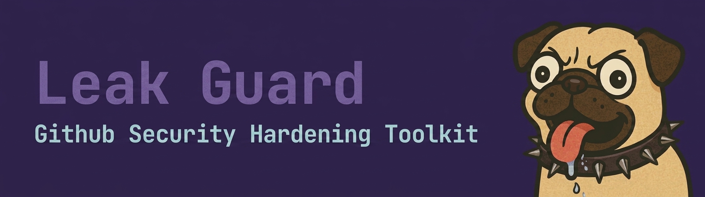

<p align="center">
  
</p>

[](https://www.npmjs.com/package/leakguard)
[](https://www.npmjs.com/package/leakguard)
[](https://github.com/rafalopes/leakguard/blob/main/LICENSE)
[](https://nodejs.org)


**LeakGuard** hardens GitHub organizations on the **free plan** by scanning for leaks at three boundaries where secrets escape:

1. **Layer 1 -- Commit time:** Pre-commit hooks catch secrets, sensitive keywords, and dangerous file types before they enter the repo.
2. **Layer 2 -- CI time:** GitHub Actions re-run the same scans on push/PR as a server-side safety net.
3. **Layer 3 -- Distribution time:** When files move from a private repo to a public `-dist` repo, deploy scans the content, then encrypts it before pushing. Encryption serves a dual purpose: it keeps content confidential *and* acts as a final safety net -- even if a scan misses something, the published output is ciphertext.

The riskiest boundary is distribution. Commits and CI operate within a private repo; distribution crosses from private to public. That is why Layer 3 exists.

> **No security tool is bulletproof -- LeakGuard is no exception.**
> Every git hook can be bypassed with `--no-verify`, and free-tier GitHub cannot enforce status checks on private repos. Think of LeakGuard as a seatbelt, not an armored vault.

---

## Table of Contents

- [Table of Contents](#table-of-contents)
- [Quick Start](#quick-start)
- [1. GitHub Organization Security Overview](#1-github-organization-security-overview)
  - [Why Org-Level Security Matters](#why-org-level-security-matters)
  - [Shared Responsibility Model](#shared-responsibility-model)
- [2. Security Features by GitHub Plan](#2-security-features-by-github-plan)
  - [What This Means for Free Plan Users](#what-this-means-for-free-plan-users)
  - [Upgrade Path](#upgrade-path)
- [3. Secret and Credential Management](#3-secret-and-credential-management)
  - [Why Secrets Leak](#why-secrets-leak)
  - [Types of Secrets to Watch For](#types-of-secrets-to-watch-for)
  - [Best Practices](#best-practices)
- [4. How This Project Works](#4-how-this-project-works)
  - [Architecture](#architecture)
  - [Tool Choice: gitleaks](#tool-choice-gitleaks)
  - [Encrypted Keyword Scanning](#encrypted-keyword-scanning)
  - [File Type Blocking](#file-type-blocking)
  - [Files Reference](#files-reference)
- [5. Setup Guide](#5-setup-guide)
  - [Prerequisites](#prerequisites)
  - [Install](#install)
  - [CLI Reference](#cli-reference)
  - [Shell Completion](#shell-completion)
  - [For New Developers Joining the Org](#for-new-developers-joining-the-org)
  - [Adding or Updating Keywords](#adding-or-updating-keywords)
  - [One-Time History Audit](#one-time-history-audit)
  - [Creating Encrypted Archives](#creating-encrypted-archives)
  - [Layer 3: Secure Distribution (Private Repo to Public `-dist` Repo)](#layer-3-secure-distribution-private-repo-to-public--dist-repo)
  - [Receiving Deployed Content](#receiving-deployed-content)
  - [Customizing File Type Blocking](#customizing-file-type-blocking)
- [6. Handling Cases](#6-handling-cases)
  - [A File Type Is Blocked](#a-file-type-is-blocked)
  - [A Secret Is Detected (Pre-Commit Blocked)](#a-secret-is-detected-pre-commit-blocked)
  - [A Secret Has Already Been Committed](#a-secret-has-already-been-committed)
  - [A Keyword Match Is Found](#a-keyword-match-is-found)
  - [CI Workflow Fails](#ci-workflow-fails)
  - [Emergency Bypass](#emergency-bypass)
- [7. 2FA and Access Control](#7-2fa-and-access-control)
  - [Two-Factor Authentication](#two-factor-authentication)
  - [Access Control Best Practices](#access-control-best-practices)
  - [CODEOWNERS](#codeowners)
- [8. Maintenance](#8-maintenance)
  - [Updating Gitleaks](#updating-gitleaks)
  - [Updating the Keyword List](#updating-the-keyword-list)
  - [Adding New Repos](#adding-new-repos)
  - [Monitoring](#monitoring)
  - [Additional Hardening](#additional-hardening)
- [Limitations (Free Plan)](#limitations-free-plan)

---

## Quick Start

```bash
npm install -g leakguard    # or use npx leakguard for one-off runs
cd /path/to/your-repo
leakguard init
```

The interactive wizard will:
- Install [gitleaks](https://github.com/gitleaks/gitleaks) (if not already present)
- Set up the encryption key for keyword scanning
- Configure file type blocking for the repo
- Install the pre-commit hook (Layer 1)
- Copy the GitHub Actions workflow (Layer 2)

After setup, every `git commit` is automatically scanned for secrets, sensitive keywords, and dangerous file types. See [Setup Guide](#5-setup-guide) for detailed options, and [Layer 3](#layer-3-secure-distribution-private-repo-to-public--dist-repo) if you publish to a public repo.

---

## 1. GitHub Organization Security Overview

### Why Org-Level Security Matters

A single leaked API key or database credential can lead to unauthorized access, data breaches, and financial loss. GitHub repositories -- even private ones -- are a common source of accidental credential exposure.

Organization-level security creates consistent protection across all repositories rather than relying on individual developers to remember best practices for every commit.

### Shared Responsibility Model

| Layer | Responsibility | Examples |
|-------|---------------|----------|
| **GitHub Platform** | Infrastructure security, account protection, platform features | 2FA, audit logs, SAML SSO (paid) |
| **Org Admins** | Configuring org policies, enabling security features, managing access | Branch protection, secret scanning, member permissions |
| **Developers** | Following secure coding practices, using provided tooling | Not hardcoding secrets, running pre-commit hooks, using `.env` files |

This toolkit addresses the **org admin** and **developer** layers using free tooling.

---

## 2. Security Features by GitHub Plan

| Feature | Free | Team ($4/user/mo) | Enterprise |
|---------|------|--------------------|------------|
| Private repositories | Yes | Yes | Yes |
| 2FA enforcement | Yes | Yes | Yes |
| Dependabot alerts | Yes | Yes | Yes |
| Branch protection (public repos) | Yes | Yes | Yes |
| Branch protection (private repos) | No | Yes | Yes |
| Required status checks | No | Yes | Yes |
| Secret scanning (push protection) | No | No | Add-on ($19/user/mo) |
| SAML SSO | No | No | Yes |
| Audit log API | No | No | Yes |
| CODEOWNERS enforcement | No | Yes | Yes |
| Actions minutes (private repos) | 2,000/mo | 3,000/mo | 50,000/mo |

### What This Means for Free Plan Users

- **Cannot enforce branch protection** on private repos -- the CI workflow will show red/green status but cannot block merges
- **Cannot use GitHub-native secret scanning** -- this toolkit provides an equivalent using gitleaks
- **CODEOWNERS file works** for PR review suggestions but cannot be enforced as required reviewers
- **2,000 Actions minutes/month** is more than enough for security scans (~10-30 seconds per run)

### Upgrade Path

When the team grows, **GitHub Team** ($4/user/month) is the recommended upgrade:
- Branch protection on private repos makes the gitleaks CI scan a hard gate
- Required status checks prevent merging when scans fail
- CODEOWNERS enforcement guarantees review coverage

---

## 3. Secret and Credential Management

### Why Secrets Leak

| Cause | Example |
|-------|---------|
| Hardcoded credentials | `const API_KEY = "sk-live-abc123..."` |
| Copy-paste from docs | Pasting a real key into a code example |
| Debug leftovers | Temporarily adding a key for testing, forgetting to remove it |
| Config files | Committing `.env`, `credentials.json`, or `serviceAccountKey.json` |
| Connection strings | Database URLs with embedded passwords |

### Types of Secrets to Watch For

- **API keys**: AWS (`AKIA...`), GCP, Azure, OpenAI, Stripe, Twilio, SendGrid
- **Tokens**: GitHub PATs (`ghp_...`), npm tokens, OAuth tokens, JWTs
- **Passwords**: Database passwords, SMTP credentials, admin passwords
- **Private keys**: SSH keys, TLS/SSL certificates (`.pem`, `.key`), GPG keys
- **Connection strings**: Database URLs, Redis URLs, message queue URLs

### Best Practices

1. **Use environment variables** -- load secrets from `process.env`, never hardcode them
2. **Use `.env` files locally** -- and always gitignore them
3. **Provide `.env.example`** -- a template with placeholder values (committed to repo)
4. **Use a secret manager in production** -- GitHub Secrets for CI, cloud-native vaults for deployed apps
5. **Rotate secrets regularly** -- and immediately if any exposure is suspected
6. **Scope secrets narrowly** -- use the minimum permissions needed

---

## 4. How This Project Works

LeakGuard scans for three categories of leaks across three boundaries.

### Architecture

```
Layer 1: Commit            Layer 2: CI               Layer 3: Distribution
======================     ======================     ======================

 git commit                 push / PR                  leakguard deploy
     |                          |                          |
 pre-commit hook            GitHub Actions             deploy scans
     |                          |                          |
 +---+---+---+             +---+---+---+              +---+---+
 |   |   |   |             |   |   |   |              |   |   |
 v   v   v   |             v   v   v   |              v   v   |
 FT  KW  GL  |             FT  KW  GL  |              KW  GL  |
 |   |   |   |             |   |   |   |              |   |   |
 +---+---+---+             +---+---+---+              +---+---+
     |                          |                          |
 pass/fail                  pass/fail                 encrypt + push
```

**FT** = File type check (extension + MIME)
**KW** = Keyword scan (encrypted blocklist)
**GL** = Gitleaks (secret/credential patterns)

Layers 1 and 2 run identical scans (FT + KW + GL) inside the private repo. Layer 3 runs KW + GL on the distribution folder (no file type check -- the content is about to be encrypted anyway), then encrypts and pushes to the public `-dist` repo.

### Tool Choice: gitleaks

**gitleaks** was chosen over alternatives (trufflehog, detect-secrets) because:
- Single Go binary with no runtime dependencies
- Sub-second pre-commit scans on staged files
- 150+ built-in secret patterns covering all major cloud providers
- MIT license for the CLI (no AGPL concerns)
- Works both as a local hook and in GitHub Actions

### Encrypted Keyword Scanning

Some repos contain sensitive business terms (client names, project codenames, internal identifiers) that must never leak. A simple plaintext blocklist would itself be a leak, so:

1. Keywords are added via `leakguard blacklist` and encrypted with `openssl enc -aes-256-cbc -pbkdf2` using a shared passphrase
2. Only `security-keywords.enc` is committed to the repo -- no plaintext ever touches disk
3. The pre-commit hook decrypts it at scan time and greps staged changes
4. GitHub Actions decrypts it using the `LEAKGUARD_SECURITY_KEY` repo secret

### File Type Blocking

Two detection layers prevent dangerous or unscannable files:

1. **Extension check** -- blocks known dangerous extensions (`.exe`, `.env`, `.pem`, etc.)
2. **MIME type check** -- uses `file --mime-type` to read file magic bytes, catching renamed files (e.g., a `.png` renamed to `.txt` is still detected as `image/png`)

Unscannable binary files (images, videos, PDFs, etc.) must be shipped inside an **encrypted `.7z` archive** -- the only allowed archive format.

### Files Reference

| File | Purpose | Committed? |
|------|---------|------------|
| `.gitleaks.toml` | Secret scanning rules and allowlist | Yes |
| `.security-filetypes` | Extension + MIME type blocklist per repo | Yes |
| `security-keywords.enc` | Encrypted keyword blocklist | Yes |
| `.security-key` | Decryption passphrase | No (gitignored) |
| `.github/workflows/secret-scan.yml` | CI workflow | Yes |
| `.git/hooks/pre-commit` | Local pre-commit hook | No (per-machine) |
| `.leakguardrc` | Distribution and deploy config | Yes |
| `.git/hooks/pre-commit-dist` | Pre-commit hook for `-dist` repos (allowlist only) | No (per-machine) |
| `.git/leakguard-audit.log` | Timestamped log of scan pass/block decisions | No (inside `.git/`) |

---

## 5. Setup Guide

### Prerequisites

- **Git**
- **Node.js 18+**
- **openssl** -- used for AES-256-CBC encryption of keyword blocklists
- **[GitHub CLI (`gh`)](https://cli.github.com)** -- used during setup to sync the encryption key as a GitHub repo secret (`LEAKGUARD_SECURITY_KEY`) and to create/manage the public `-dist` repo. Also needed for org admin tasks (2FA audits, Dependabot setup, member reviews)
- A terminal (bash, zsh, or Git Bash on Windows)

### Install

Install globally:

```bash
npm install -g leakguard
```

Or run any command on-demand with `npx` (no global install needed):

```bash
npx leakguard [command] [options]
```

If installed globally, replace `npx leakguard` with just `leakguard` in all examples below.

### CLI Reference

| Command | Description |
|---------|-------------|
| `leakguard` / `leakguard init` | Interactive TUI setup (default) |
| `leakguard blacklist kw1 kw2` | Add/merge keywords into encrypted blocklist |
| `leakguard blacklist kw1 --override` | Replace entire keyword list |
| `leakguard blacklist -l` / `--list` | Show current keywords |
| `leakguard blacklist -r kw1 kw2` | Remove specific keywords |
| `leakguard scan-history [dir...]` | One-time full-history audit |
| `leakguard zip <files...>` | Create encrypted .7z archive |
| `leakguard deploy [path]` | Layer 3: scan, encrypt, and push to the public `-dist` repo |
| `leakguard deploy --chunked` | Deploy as encrypted text chunks (stronger encryption) |
| `leakguard deploy --7z` | Deploy as a single encrypted .7z archive |
| `leakguard deploy --config` | Interactive deploy configuration |
| `leakguard deploy --config k=v` | Set deploy config values directly |
| `leakguard deploy --dry-run` | Run scans and create archive, but don't push |
| `leakguard deploy -y` / `--yes` | Skip confirmation prompt |
| `leakguard setup-dist` | Set up the public `-dist` distribution repo |
| `leakguard reassemble <out> <dir>` | Reassemble encrypted chunks into archive |
| `leakguard uninstall` | Remove LeakGuard artifacts from repo |
| `leakguard completion` | Output shell completion script (bash/zsh) |
| `leakguard --help` | Show help |
| `leakguard --version` | Print version |

**Deploy config keys** (set via `leakguard deploy --config key=value`):

| Key | Values | Description |
|-----|--------|-------------|
| `defaultMode` | `chunked` / `7z` | Default deploy mode |
| `chunkSize` | `500kb`, `1mb`, `3n`, etc. | Chunk size (bytes, kb, mb, gb, or Nn for N equal parts) |
| `archiveName` | string | Archive name template (`{folder}` = dist folder) |
| `skipGitleaks` | `true` / `false` | Skip gitleaks scan during deploy |
| `skipKeywords` | `true` / `false` | Skip keyword scan during deploy |
| `commitMessage` | string | Commit message template (`{archiveName}`, `{chunkCount}`) |
| `keepArchive` | `false` / path | Save archive copy before cleanup |
| `createRelease` | `true` / `false` | Create GitHub Release (7z mode only) |

**Examples with npx:**

```bash
# Show help
npx leakguard --help

# Interactive setup (run from your repo root)
npx leakguard init

# Add keywords to the encrypted blocklist
npx leakguard blacklist "client name" project-codename internal-id

# List current keywords
npx leakguard blacklist --list

# Remove keywords
npx leakguard blacklist --remove "client name"

# Replace entire keyword list
npx leakguard blacklist kw1 kw2 --override

# Full-history audit on specific repos
npx leakguard scan-history /path/to/repo1 /path/to/repo2

# Package binary files into encrypted .7z
npx leakguard zip assets/ config.dat

# Deploy curated content to the public -dist repo
npx leakguard deploy

# Deploy in chunked mode (encrypted text chunks, stronger encryption)
npx leakguard deploy --chunked

# Dry-run deploy (scans and archives but doesn't push)
npx leakguard deploy --dry-run

# Set up the -dist repo independently
npx leakguard setup-dist
```

### Shell Completion

LeakGuard provides tab completion for bash and zsh, covering all commands and subcommand flags.

**Enable for current session:**
```bash
eval "$(leakguard completion)"
```

**Enable permanently:**
```bash
# bash
echo 'eval "$(leakguard completion)"' >> ~/.bashrc

# zsh
echo 'eval "$(leakguard completion)"' >> ~/.zshrc
```

**Note:** Shell completion requires a global install (`npm install -g leakguard`). It does not work with `npx` because the shell binds completions to the command name `leakguard`, but `npx` makes the shell see `npx` as the command instead. This is a universal limitation -- no npm CLI tool supports tab completion via `npx`.

### For New Developers Joining the Org

1. **Get the encryption key** from a teammate via a secure channel (Signal, 1Password, in person -- never Slack/email/GitHub).

2. **Run setup on each repo** you work with:
   ```bash
   cd /path/to/your-repo
   npx leakguard init
   ```

3. The TUI will walk you through:
   - Installing gitleaks (if needed)
   - Entering the shared encryption key
   - Configuring file type blocking for this repo
   - Installing the pre-commit hook
   - Copying the CI workflow and gitleaks config

4. **Commit the new files** added to your repo:
   ```bash
   git add .gitignore .gitleaks.toml .security-filetypes .github/workflows/secret-scan.yml security-keywords.enc
   git commit -m "Add security scanning configuration"
   ```

### Adding or Updating Keywords

Add or merge keywords directly from the CLI (no plaintext file needed):

```bash
npx leakguard blacklist "client name" project-codename internal-id
```

To replace the entire list instead of merging:

```bash
npx leakguard blacklist kw1 kw2 kw3 --override
```

To view or remove keywords:

```bash
npx leakguard blacklist --list
npx leakguard blacklist --remove "client name" internal-id
```

After any change, commit `security-keywords.enc` (never the plaintext).

### One-Time History Audit

Scan existing repos for previously committed secrets:

```bash
# Scan specific repos
npx leakguard scan-history /path/to/repo1 /path/to/repo2

# Scan all git repos in current directory
npx leakguard scan-history
```

Reports are saved to `./reports/`.

### Creating Encrypted Archives

Binary files that need to be in the repo must be packaged in an encrypted `.7z` archive:

```bash
# Single file
npx leakguard zip myfile.bin

# Multiple files or directories
npx leakguard zip assets/ config.dat
```

You will be prompted for a password. The archive is created in the current directory.

### Layer 3: Secure Distribution (Private Repo to Public `-dist` Repo)

Distribution is the riskiest boundary: files cross from a private repo to a public one. A single missed secret becomes permanently public. LeakGuard's deploy command addresses this by scanning the distribution folder with gitleaks and the keyword blocklist, then encrypting the content before pushing it to a companion public `-dist` repo. Encryption keeps the content confidential and doubles as a safety net -- even if a scan misses something, what reaches the public repo is ciphertext, not cleartext source.

**Initial setup:**

Run `leakguard setup-dist` (or select the distribution option during `leakguard init`). This will:
- Create a public `<repo-name>-dist` repo on GitHub (via `gh`)
- Bootstrap it with leakguard security config (gitleaks rules, file type blocking, a dist-specific pre-commit hook)
- Save the config to `.leakguardrc` in your private repo
- Create a distribution folder (default: `public-dist/`)

```bash
npx leakguard setup-dist
```

**Deploy workflow:**

1. Place files you want to distribute in the distribution folder.

2. Run deploy:
   ```bash
   npx leakguard deploy
   ```

3. Deploy will:
   - Scan the folder with gitleaks and the keyword blocklist
   - Block the deploy if secrets or sensitive keywords are found
   - Create an encrypted archive from the folder contents
   - Push the archive to the `-dist` repo

**Deploy modes:**

| Mode | Flag | Description |
|------|------|-------------|
| Chunked (default) | `--chunked` | Creates a plain ZIP, encrypts the whole payload (PBKDF2 + AES-256-CBC), then splits the ciphertext into text chunks (`.nofbiz` files). |
| 7z | `--7z` | Single encrypted `.7z` archive. Optionally creates a GitHub Release (`createRelease=true`). |

Configure the default mode and other settings with `leakguard deploy --config`.

The `-dist` repo has its own pre-commit hook (`pre-commit-dist`) that only allows archives and leakguard config files -- preventing accidental commits of unscanned content.

### Receiving Deployed Content

Recipients can decrypt chunked deploys in two ways:

*CLI (requires Node.js):*
```bash
npx leakguard reassemble output.zip ./chunks --checksum <sha256>
```

*Browser (no installs required):*
Open [`reassemble.html`](reassemble.html) in any modern browser (Chrome 80+, Edge 80+, Firefox 105+, Safari 16.4+). Paste the chunk contents, enter the passphrase, and view or download the decrypted files directly. Everything runs locally -- no server, no file system access, no network requests. This is designed for locked-down corporate machines where CLI tools are unavailable.

Both methods use the same cryptographic parameters: PBKDF2 (100,000 iterations, SHA-256) for key derivation and AES-256-CBC for decryption. The deploy output includes a SHA-256 checksum for verification.

### Customizing File Type Blocking

Edit `.security-filetypes` in your repo:
- Add extensions to `[extensions]` to block by filename
- Add MIME prefixes to `[mime-types]` to block by content type
- Add exceptions to `[allowed-types]` for MIME types that should pass
- Add specific file paths to `[allowed-files]` to override all rules

---

## 6. Handling Cases

### A File Type Is Blocked

**Situation**: Your commit is rejected because of a blocked file type.

**Options**:
1. **Remove the file** if it doesn't belong in the repo
2. **Add to `.security-filetypes` `[allowed-files]`** if this specific file is needed:
   ```
   [allowed-files]
   assets/logo.png
   docs/architecture.pdf
   ```
3. **Package in encrypted .7z** if the binary must be in the repo:
   ```bash
   7z a -p -mhe=on archive.7z myfile.bin
   # Add archive.7z instead of myfile.bin
   ```

### A Secret Is Detected (Pre-Commit Blocked)

**Situation**: gitleaks found what looks like a credential in your staged changes.

**Steps**:
1. Check if it's a **real secret** or a **false positive**
2. If real: remove the secret, use an environment variable instead
3. If false positive: add an allowlist entry to `.gitleaks.toml`:
   ```toml
   [allowlist]
   paths = [
       # existing entries...
       '''path/to/false-positive-file\.js$''',
   ]
   ```
4. Alternatively, add an inline comment: `# gitleaks:allow`

### A Secret Has Already Been Committed

**Situation**: A secret was found in git history (via `leakguard scan-history` or CI).

**Steps**:
1. **Rotate the secret immediately** -- generate a new key/token and update wherever it's used
2. **Consider the old secret compromised** regardless of whether anyone else accessed the repo
3. **Clean history if needed** (optional, since private repos):
   ```bash
   # Using git-filter-repo (install: pip install git-filter-repo)
   git filter-repo --invert-paths --path path/to/secret-file
   ```
4. Add the file pattern to `.gitignore` to prevent recurrence

### A Keyword Match Is Found

**Situation**: The keyword scan blocked your commit because a sensitive term was found.

**Steps**:
1. Review the match -- is this term actually sensitive in this context?
2. If sensitive: rephrase or use a codename/abbreviation
3. If the keyword is no longer sensitive: remove it with `leakguard blacklist --remove <keyword>` and commit `security-keywords.enc`

### CI Workflow Fails

**Situation**: The GitHub Actions security scan failed on push or PR.

**Steps**:
1. Check the Actions log to see which scan failed (file type, keyword, or secret)
2. Fix the issue locally and push again
3. Note: On the free plan, a failed check cannot block a merge -- treat it as a strong warning

### Emergency Bypass

In genuine emergencies, you can skip the pre-commit hook:
```bash
git commit --no-verify -m "emergency: <reason>"
```

This skips ALL local checks. The CI workflow will still run on push. Use this sparingly -- every bypass should be reviewed afterward.

---

## 7. 2FA and Access Control

### Two-Factor Authentication

2FA is the single most impactful security measure for a GitHub org. It protects against:
- Credential stuffing (password reuse from data breaches)
- Phishing attacks
- Unauthorized access if a password is compromised

**Check current status**:
```bash
# List members without 2FA (should return empty)
gh api /orgs/<your-org>/members?filter=2fa_disabled
```

**Enable org-wide requirement**:
1. Go to org Settings > Authentication security
2. Check "Require two-factor authentication for everyone in the organization"
3. Coordinate with all members first -- anyone without 2FA will be removed from the org

### Access Control Best Practices

- **Principle of least privilege**: Give the minimum permissions needed
- **Use teams** for permission groups rather than individual access
- **Review access regularly**: Check who has access to what
- **Use deploy keys** for CI/CD rather than personal tokens
- **Audit the org periodically**:
  ```bash
  # List all org members
  gh api /orgs/<your-org>/members --jq '.[].login'

  # List outside collaborators
  gh api /orgs/<your-org>/outside_collaborators --jq '.[].login'
  ```

### CODEOWNERS

Add a `CODEOWNERS` file to each repo for review visibility:
```
# .github/CODEOWNERS
* @your-github-username
```

On the free plan this serves as a suggestion (not enforced). On GitHub Team it becomes a required review gate.

---

## 8. Maintenance

### Updating Gitleaks

Check for new versions periodically:
```bash
# Current version
gitleaks version

# Latest release
gh api /repos/gitleaks/gitleaks/releases/latest --jq '.tag_name'
```

Update on Linux:
```bash
VERSION="8.21.2"  # replace with latest
curl -sSfL "https://github.com/gitleaks/gitleaks/releases/download/v${VERSION}/gitleaks_${VERSION}_linux_x64.tar.gz" \
  | sudo tar -xz -C /usr/local/bin gitleaks
```

Also update the version in `workflows/secret-scan.yml`.

### Updating the Keyword List

1. Add, remove, or replace keywords:
   ```bash
   npx leakguard blacklist "new keyword"
   npx leakguard blacklist --remove "old keyword"
   ```
2. Commit `security-keywords.enc`
3. Other devs pull and get the updated encrypted list automatically
4. Ensure the CI `LEAKGUARD_SECURITY_KEY` repo secret is still current

### Adding New Repos

1. `cd` into the new repo
2. Run `npx leakguard init`
3. Commit the generated files
4. The CI workflow and pre-commit hook are ready

### Monitoring

- Check GitHub Actions results after each push/PR
- Run `npx leakguard scan-history` quarterly (or when new repos are added)
- Review `.gitleaks.toml` allowlist entries periodically -- remove any that are no longer relevant
- Verify all org members have 2FA enabled
- Review `.git/leakguard-audit.log` for a history of scan pass/block decisions per repo

### Additional Hardening

These are one-time steps for org admins:

**Enable Dependabot alerts** (all repos):
```bash
for repo in repo1 repo2 repo3; do
  gh api -X PUT "/repos/<your-org>/${repo}/vulnerability-alerts"
done
```

**Enable web commit signoff** (org-wide):
- Org Settings > Repository > Default branch > Require contributors to sign off on web-based commits

---

## Limitations (Free Plan)

- Cannot enforce branch protection rules on private repos
- Cannot require status checks to pass before merging
- No GitHub-native secret scanning or push protection
- No SAML SSO or audit log API
- CODEOWNERS is advisory only (not enforced as required reviewers)

The CI workflow and pre-commit hooks in this toolkit compensate for most of these limitations at the developer workflow level, but a determined developer can bypass them with `--no-verify` or by merging without review.

Upgrading to **GitHub Team** ($4/user/month) enables branch protection and required status checks, making the security scans a hard gate that cannot be bypassed through the normal workflow.
